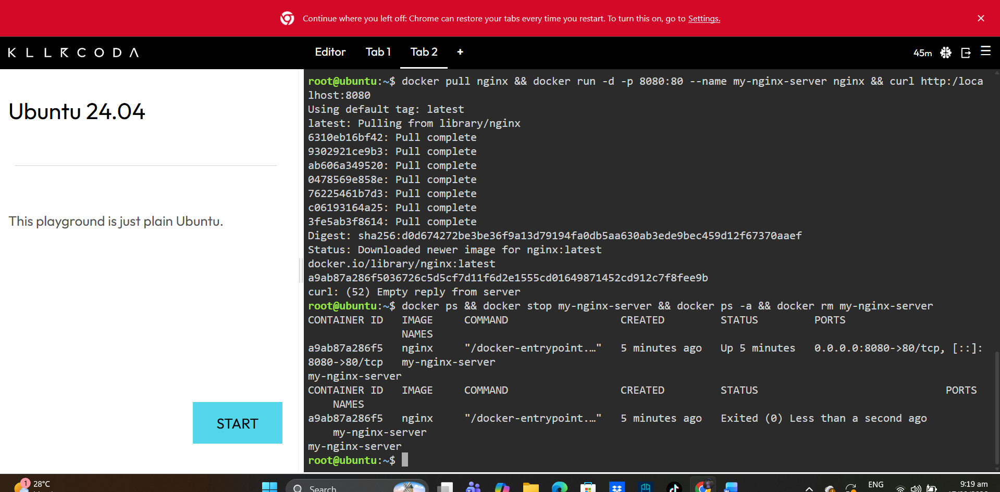

# Docker Deployment & Container Lifecycle Documentation

## Docker Commands Executed and Descriptions

1. `docker ps`
   * **Explanation:** Displays all active, currently running containers along with their container IDs, image names, creation status, and port mappings.

2. `docker stop my-nginx-server`
   * **Explanation:** Sends a `SIGTERM` signal to gracefully halt the execution of the running `my-nginx-server` container without destroying its data state.

3. `docker ps -a`
   * **Explanation:** Lists all containers on the host system, including those that are currently running, paused, or exited/stopped.

4. `docker rm my-nginx-server`
   * **Explanation:** Permanently deletes the stopped `my-nginx-server` container instance from the local host system.

## Terminal Output Screenshot

Below is the screenshot showing the complete execution of the container lifecycle commands:

